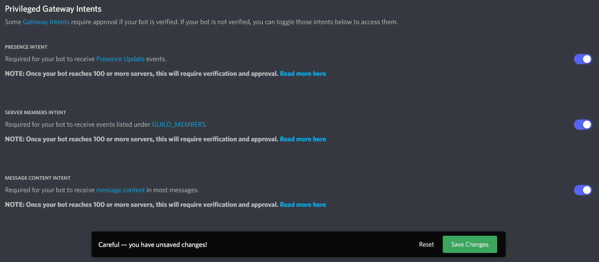

<a name="readme-top"></a>

<!-- Projet Shields -->
[![Contributors][contributors-shield]][contributors-url]
[![Forks][forks-shield]][forks-url]
[![Stargazers][stars-shield]][stars-url]
[![Issues][issues-shield]][issues-url]
[![MIT License][license-shield]][license-url]
[![LinkedIn][linkedin-shield]][linkedin-url]


<!-- PROJECT LOGO -->
<br />
<div align="center">
  <a href="https://github.com/Isnubi/FeurBot/">
    
  </a>


<h3 align="center">FeurBot</h3>
  <p align="center">
    <a href="https://github.com/Isnubi/FeurBot/"><strong>Explore the docs »</strong></a>
    <br />--------------------
    <br />
    <a href="https://github.com/Isnubi/FeurBot/issues">Report Bug</a>
    ·
    <a href="https://github.com/Isnubi/FeurBot/issues">Request Feature</a>
  </p>
</div>


<!-- TABLE OF CONTENTS -->
<details>
  <summary>Table of Contents</summary>
  <ol>
    <li>
      <a href="#about-the-project">About The Project</a>
      <ul>
        <li><a href="#built-with">Built With</a></li>
      </ul>
    </li>
    <li>
      <a href="#getting-started">Getting Started</a>
      <ul>
        <li><a href="#prerequisites">Prerequisites</a></li>
        <li><a href="#installation">Installation</a></li>
      </ul>
    </li>
    <li><a href="#usage">Usage</a></li>
    <li><a href="#roadmap">Roadmap</a></li>
    <li><a href="#contributing">Contributing</a></li>
    <li><a href="#license">License</a></li>
    <li><a href="#contact">Contact</a></li>
  </ol>
</details>


<!-- ABOUT THE PROJECT -->
## About The Project

**The bot is currently being updated for the V2 of discord.py library**<br>
**You can check it in [V2_Update](https://github.com/Isnubi/FeurBot/tree/V2_update) branch**

<div align="center">
    
</div>

FeurBot is a Discord bot, developed in Python, that can be used to play music, to do quizzes, to moderate a server, to display hardware statistics, and more.

<p align="right">(<a href="#readme-top">back to top</a>)</p>


### Built With

* [![Python][Python]][Python-url]
* [![MySQL][MySQL]][MySQL-url]

<p align="right">(<a href="#readme-top">back to top</a>)</p>


<!-- GETTING STARTED -->
## Getting Started
<a name="getting-started"></a>

You can install FeurBot on your own server by following these steps.

### Prerequisites

1. Clone the repository on your computer.

    ```sh
    git clone https://github.com/Isnubi/FeurBot.git
    cd FeurBot
    ```

2. Run the install script as user (not root).

    ```sh
    sudo chmod +x install.sh
    sudo ./install.sh
    ```
    
    If the script didn't work, you can follow [these steps](Manual_Installation.md).

### Installation

1. Get a free Giphy API Key at [https://developers.giphy.com/](https://developers.giphy.com/)
2. Create a Discord bot at [https://discord.com/developers/applications](https://discord.com/developers/applications)
   * Create a new application
   * Go to the "Bot" tab
   * Click on "Add Bot" and confirm
   * Active the intents options
   
   * Copy the token
   * Go to the "OAuth2" tab
     * Select the "bot" scope
     * Select the "applications.commands" scope
     * Select the "Administrator" permission
     
     * Copy the generated URL
     * Invite the bot to your server
3. Enter your bot token, your Giphy API Key and your database informations in `private/config.py`
    ```python
    token = 'DISCORD_BOT_TOKEN'
    giphy_api_key = 'GIPHY_API_KEY'
    
    mysql_host = 'DATABASE_HOST'
    mysql_user = 'DATABASE_USER'
    mysql_password = 'DATABASE_PASSWORD'
    mysql_database = 'DATABASE_NAME'
    ```
4. Run the bot
    ```sh
   python3 FeurBot.py
   ```


<p align="right">(<a href="#readme-top">back to top</a>)</p>


<!-- USAGE EXAMPLES -->
## Usage

* The bot is using slash commands so you can use them by typing `/` in a channel.
* You can get the help menu by sending.
    ```
    /help <page_number>
    ```
  You can navigate in it with the reactions.

_For more examples, please refer to the help menu of the bot._

<p align="right">(<a href="#readme-top">back to top</a>)</p>


<!-- ROADMAP -->
## Roadmap

- [ ] Music system
    - [ ] Music player
    - [ ] Music commands
    - [ ] Music queue

See the [open issues](https://github.com/Isnubi/FeurBot/issues) for a full list of proposed features (and known issues).

<p align="right">(<a href="#readme-top">back to top</a>)</p>


<!-- CONTRIBUTING -->
## Contributing

Contributions are what make the open source community such an amazing place to learn, inspire, and create. Any contributions you make are **greatly appreciated**.

If you have a suggestion that would make this better, please fork the repo and create a pull request. You can also simply open an issue with the tag "enhancement".
Don't forget to give the project a star! Thanks again!

1. Fork the Project
2. Create your Feature Branch (`git checkout -b feature/AmazingFeature`)
3. Commit your Changes (`git commit -m 'Add some AmazingFeature'`)
4. Push to the Branch (`git push origin feature/AmazingFeature`)
5. Open a Pull Request

<p align="right">(<a href="#readme-top">back to top</a>)</p>


<!-- LICENSE -->
## License

Distributed under the MIT License. See `LICENSE.md` for more information.

<p align="right">(<a href="#readme-top">back to top</a>)</p>


<!-- CONTACT -->
## Contact


Isnubi - [@Louis_Gambart](https://twitter.com/Louis_Gambart) - [contact@louis-gambart.fr](mailto:contact@louis-gambart.fr)
<br>**Discord:** isnubi#6221

**Project Link:** [https://github.com/Isnubi/FeurBot](https://github.com/Isnubi/FeurBot)

<p align="right">(<a href="#readme-top">back to top</a>)</p>


<!-- MARKDOWN LINKS & IMAGES -->
<!-- https://www.markdownguide.org/basic-syntax/#reference-style-links -->
[contributors-shield]: https://img.shields.io/github/contributors/Isnubi/FeurBot.svg?style=for-the-badge
[contributors-url]: https://github.com/Isnubi/FeurBot/graphs/contributors
[forks-shield]: https://img.shields.io/github/forks/Isnubi/FeurBot.svg?style=for-the-badge
[forks-url]: https://github.com/Isnubi/FeurBot/network/members
[stars-shield]: https://img.shields.io/github/stars/Isnubi/FeurBot.svg?style=for-the-badge
[stars-url]: https://github.com/Isnubi/FeurBot/stargazers
[issues-shield]: https://img.shields.io/github/issues/Isnubi/FeurBot.svg?style=for-the-badge
[issues-url]: https://github.com/Isnubi/FeurBot/issues
[license-shield]: https://img.shields.io/github/license/Isnubi/FeurBot.svg?style=for-the-badge
[license-url]: https://github.com/Isnubi/FeurBot/blob/master/LICENSE.md
[linkedin-shield]: https://img.shields.io/badge/-LinkedIn-black.svg?style=for-the-badge&logo=linkedin&colorB=555
[linkedin-url]: https://linkedin.com/in/louis-gambart
[Python]: https://img.shields.io/badge/Python-3776AB?style=for-the-badge&logo=python&logoColor=white
[Python-url]: https://www.python.org/
[Mysql]: https://img.shields.io/badge/MySQL-00000F?style=for-the-badge&logo=mysql&logoColor=white
[Mysql-url]: https://www.mysql.com/
[Twitter-shield]: https://img.shields.io/twitter/follow/Louis_Gambart?style=social
[Twitter-url]: https://twitter.com/Louis_Gambart/