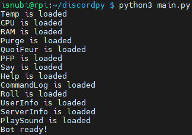

# FeurBot

**FeurBot** is a Discord bot developed in *Python* which provides multiples command for users of discord server.

It contains some features like leveling, quiz, roleplay, etc.

## Dependencies

FeurBot have been tested in a *3.7.3 Python environment*.

You have, if you don't already have it, to install the following packages:

```
sudo apt install python
sudo apt install pip3
```

FeurBot use different libraries, such as 
[discord.py](https://github.com/Rapptz/discord.py) 
and [psutil](https://github.com/giampaolo/psutil).
These libraries can be installed using **pip3** command.

```bash
pip3 install discord.py
pip3 install psutil
pip3 install asyncio
pip3 install youtube_dl
pip3 install discord.py[voice]
pip3 install aiohttp
```

You can also install these libraries using the requirements.txt file:
```
pip3 install -r requirements.txt
```

After you have installed all the dependencies, you have to put your Discord Bot and Giphy tokens in the **private/config.py** file.

## Usage

Once bot files have been forked and dependencies installed, 
you just have to run the **main.py** file.

```bash
python3 main.py
```

The bot will be launch and the cogs will be loaded.



Once the bot is loaded, anytime a command is called by a user, 
a line will be printed in the console.


The default prefix for the bot is **!**.

Mention the bot will answer you the current prefix used by the server.

### Commands list

There is the list of all the commands available:

General commands :
* **!help**: display the list of commands
* **!serverinfo**: display the server information
* **!userinfo**: display the user information
* **!botinfo**: display the bot information

Fun commands :
* **!quiz**: display a random quiz
* **!giphy**: display a random gif

Talk as commands :
* **!talkas**: Talk as a PNJ register in the channel
* **!addpnj**: Add a PNJ in the channel
* **!delpnj**: Delete a PNJ in the channel
* **!listpnj**: List all the PNJ in the channel

Economy commands :
* **!balance**: display the balance of the user
* **!daily**: get a daily reward every 24 hours
* **!pay**: pay a user
* **!register**: register a user if he's not registered (user is in the server before the bot join it)

Level system commands :
* **!level**: display the current level of the user
* **!leaderboard**: display the leaderboard

User commands :
* **!roll**: roll a dice
* **!say**: make the bot say something
* **!pfp**: display the user profile picture

Music commands :
* **!join**: let the bot join your voice channel
* **!play** : play a song (from YouTube URL)
* **!volume** : change the volume of the music
* **!pause** : pause the music
* **!resume** : resume the music
* **!stop** : stop the music
* **!leave** : let the bot leave your voice channel

Moderation commands :
* **!purge**: delete a number of messages
* **!kick**: kick a user
* **!ban**: ban a user
* **!unban**: unban a user
* **!banlist**: display the list of banned users
* **!mute**: mute a user
* **!unmute**: unmute a user

Prefix commands :
* Mention the bot will answer you the current prefix used by the server.
* **!setprefix**: change the bot prefix

Bot system channel commands :
* **!setchannel**: set the bot system channel
* **!resetchannel**: reset the bot system channel to the default system channel
* **!set_log_channel**: set the bot log channel

Bot owner commands :
* **!coglist**: display the list of cogs
* **!load**: load a cog
* **!unload**: unload a cog
* **!reload**: reload a cog
* **!reloadall**: reload all cogs
* **!addquiz**: add a question to the quiz
* **!removequiz**: remove a question from the quiz
* **!quizlist**: display the list of questions

Hardware statistics commands :
* **!ping**: display the bot latency
* **!cpu**: display the CPU usage
* **!ram**: display the RAM usage

## Contributing

Pull requests are welcome. For major changes, please open an issue 
first to discuss what you would like to change.

Please make sure to update tests as appropriate.

You can also contact me on Discord (**isnubi#6221**) for any contributing 
or bug submission.

## Developer

This bot is completely developed by 
[Louis GAMBART](https://github.com/Isnubi).

## License

[MIT](https://choosealicense.com/licenses/mit/)