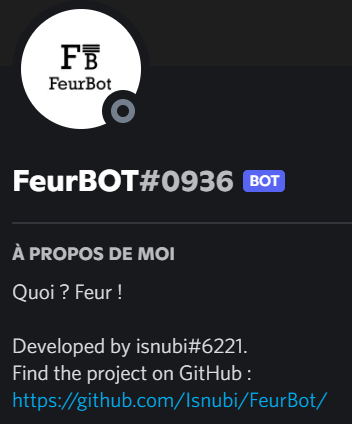

<a name="readme-top"></a>

<!-- Projet Shields -->
[![Contributors][contributors-shield]][contributors-url]
[![Forks][forks-shield]][forks-url]
[![Stargazers][stars-shield]][stars-url]
[![Issues][issues-shield]][issues-url]
[![MIT License][license-shield]][license-url]
[![LinkedIn][linkedin-shield]][linkedin-url]


<!-- PROJECT LOGO -->
<br />
<div align="center">
  <a href="https://github.com/Isnubi/FeurBot/">
    
  </a>


<h3 align="center">FeurBot</h3>
  <p align="center">
    project_description
    <br />
    <a href="https://github.com/Isnubi/FeurBot/"><strong>Explore the docs »</strong></a>
    <br />
    <br />
    <a href="https://github.com/Isnubi/FeurBot/issues">Report Bug</a>
    ·
    <a href="https://github.com/Isnubi/FeurBot/issues">Request Feature</a>
  </p>
</div>


<!-- TABLE OF CONTENTS -->
<details>
  <summary>Table of Contents</summary>
  <ol>
    <li>
      <a href="#about-the-project">About The Project</a>
      <ul>
        <li><a href="#built-with">Built With</a></li>
      </ul>
    </li>
    <li>
      <a href="#getting-started">Getting Started</a>
      <ul>
        <li><a href="#prerequisites">Prerequisites</a></li>
        <li><a href="#installation">Installation</a></li>
      </ul>
    </li>
    <li><a href="#usage">Usage</a></li>
    <li><a href="#roadmap">Roadmap</a></li>
    <li><a href="#contributing">Contributing</a></li>
    <li><a href="#license">License</a></li>
    <li><a href="#contact">Contact</a></li>
  </ol>
</details>


<!-- ABOUT THE PROJECT -->
## About The Project

<div align="center">
    
</div>

FeurBot is a Discord bot, developed in Python, that can be used to play music, to do quizzes, to moderate a server, to display hardware statistics, and more.

<p align="right">(<a href="#readme-top">back to top</a>)</p>


### Built With

* [![Python][Python]][Python-url]
* [![JSON][JSON]][JSON-url]

<p align="right">(<a href="#readme-top">back to top</a>)</p>


<!-- GETTING STARTED -->
## Getting Started
<a name="getting-started"></a>

This is an example of how you may give instructions on setting up your project locally.
To get a local copy up and running follow these simple example steps.

### Prerequisites

This is an example of how to list things you need to use the software and how to install them.
* npm
  ```sh
  npm install npm@latest -g
  ```

### Installation

1. Get a free API Key at [https://example.com](https://example.com)
2. Clone the repo
   ```sh
   git clone https://github.com/Isnubi/FeurBot.git
   ```
3. Install NPM packages
   ```sh
   npm install
   ```
4. Enter your API in `config.js`
   ```js
   const API_KEY = 'ENTER YOUR API';
   ```

<p align="right">(<a href="#readme-top">back to top</a>)</p>


<!-- USAGE EXAMPLES -->
## Usage

Use this space to show useful examples of how a project can be used. Additional screenshots, code examples and demos work well in this space. You may also link to more resources.

_For more examples, please refer to the [Documentation](https://example.com)_

<p align="right">(<a href="#readme-top">back to top</a>)</p>


<!-- ROADMAP -->
## Roadmap

- [ ] Feature 1
- [ ] Feature 2
- [ ] Feature 3
    - [ ] Nested Feature

See the [open issues](https://github.com/Isnubi/FeurBot/issues) for a full list of proposed features (and known issues).

<p align="right">(<a href="#readme-top">back to top</a>)</p>


<!-- CONTRIBUTING -->
## Contributing

Contributions are what make the open source community such an amazing place to learn, inspire, and create. Any contributions you make are **greatly appreciated**.

If you have a suggestion that would make this better, please fork the repo and create a pull request. You can also simply open an issue with the tag "enhancement".
Don't forget to give the project a star! Thanks again!

1. Fork the Project
2. Create your Feature Branch (`git checkout -b feature/AmazingFeature`)
3. Commit your Changes (`git commit -m 'Add some AmazingFeature'`)
4. Push to the Branch (`git push origin feature/AmazingFeature`)
5. Open a Pull Request

<p align="right">(<a href="#readme-top">back to top</a>)</p>


<!-- LICENSE -->
## License

Distributed under the MIT License. See `LICENSE.txt` for more information.

<p align="right">(<a href="#readme-top">back to top</a>)</p>


<!-- CONTACT -->
## Contact

Your Name - [@Louis_Gambart](https://twitter.com/Louis_Gambart) - contact@louis-gambart.fr

Project Link: [https://github.com/Isnubi/FeurBot](https://github.com/Isnubi/FeurBot)

<p align="right">(<a href="#readme-top">back to top</a>)</p>


<!-- MARKDOWN LINKS & IMAGES -->
<!-- https://www.markdownguide.org/basic-syntax/#reference-style-links -->
[contributors-shield]: https://img.shields.io/github/contributors/Isnubi/FeurBot.svg?style=for-the-badge
[contributors-url]: https://github.com/Isnubi/FeurBot/graphs/contributors
[forks-shield]: https://img.shields.io/github/forks/Isnubi/FeurBot.svg?style=for-the-badge
[forks-url]: https://github.com/Isnubi/FeurBot/network/members
[stars-shield]: https://img.shields.io/github/stars/Isnubi/FeurBot.svg?style=for-the-badge
[stars-url]: https://github.com/Isnubi/FeurBot/stargazers
[issues-shield]: https://img.shields.io/github/issues/Isnubi/FeurBot.svg?style=for-the-badge
[issues-url]: https://github.com/Isnubi/FeurBot/issues
[license-shield]: https://img.shields.io/github/license/Isnubi/FeurBot.svg?style=for-the-badge
[license-url]: https://github.com/Isnubi/FeurBot/blob/master/LICENSE.md
[linkedin-shield]: https://img.shields.io/badge/-LinkedIn-black.svg?style=for-the-badge&logo=linkedin&colorB=555
[linkedin-url]: https://linkedin.com/in/louis-gambart
[Python]: https://img.shields.io/badge/Python-3776AB?style=for-the-badge&logo=python&logoColor=white
[Python-url]: https://www.python.org/
[JSON]: https://img.shields.io/badge/JSON-5E5C5C?style=for-the-badge&logo=json&logoColor=white
[JSON-url]: https://www.json.org/json-en.html